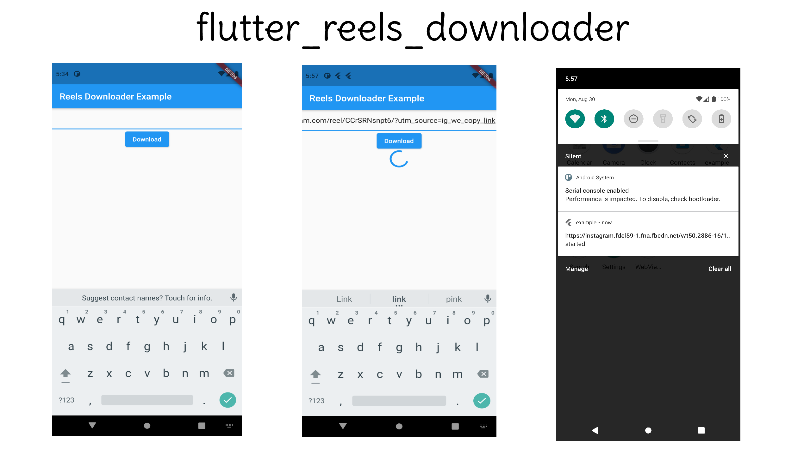

# flutter_reels_downloader

A Flutter package that helps the user to download the reels from instagram.

## How to Use

First you have to set the dependencies,
```dart
flutter_reels_downloader
```
Then you have to import the package in your project,
```dart
import 'package:flutter_reels_downloader/flutter_reels_downloader.dart';
```

### Download Reels video
```dart 
 var s = await reelDownloader.downloadReels("");//URL
```


Created by [Harsh Chhikara](https://www.linkedin.com/in/harsh-chhikara-191a84175/)